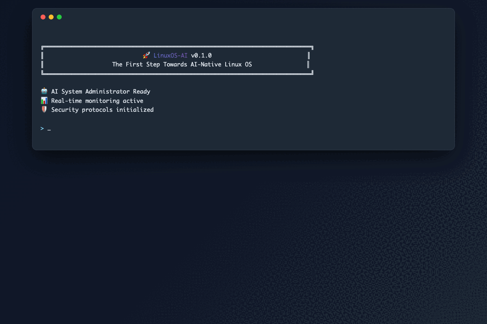
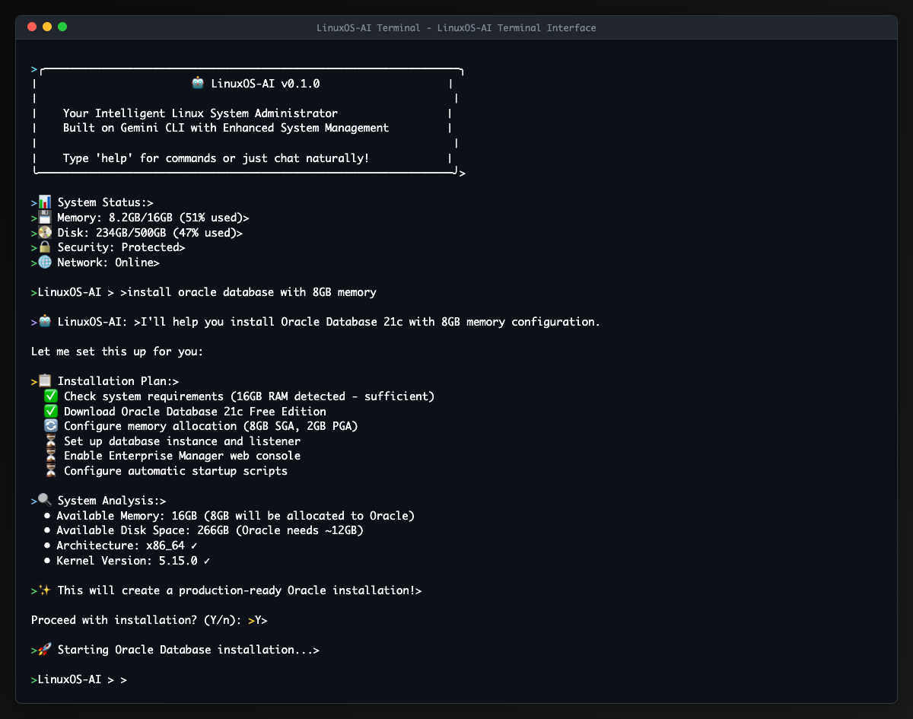
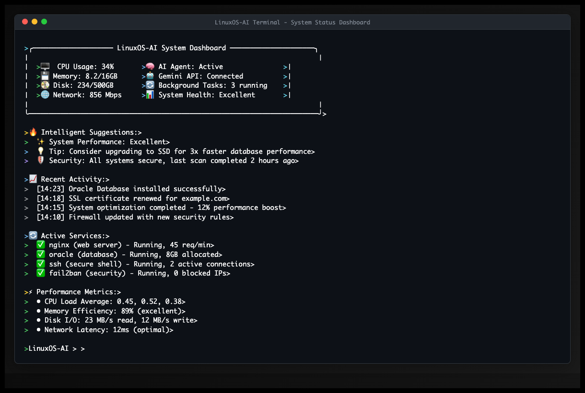
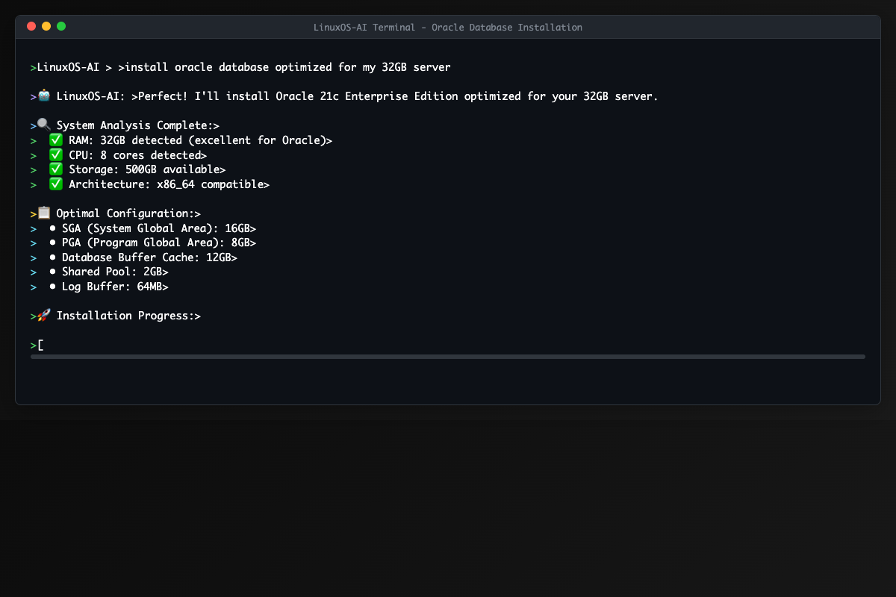
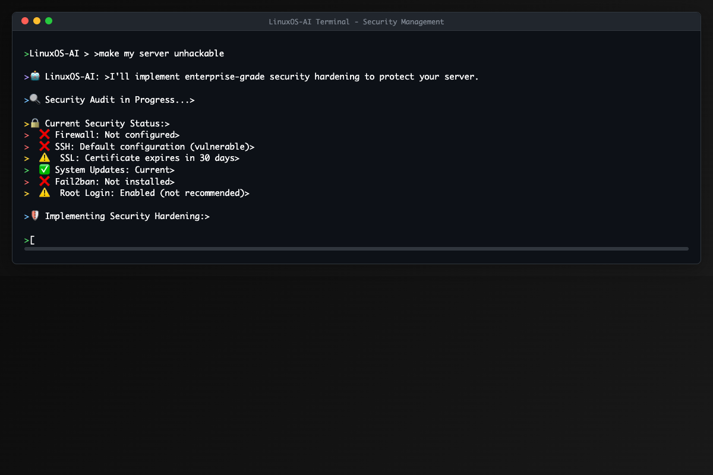
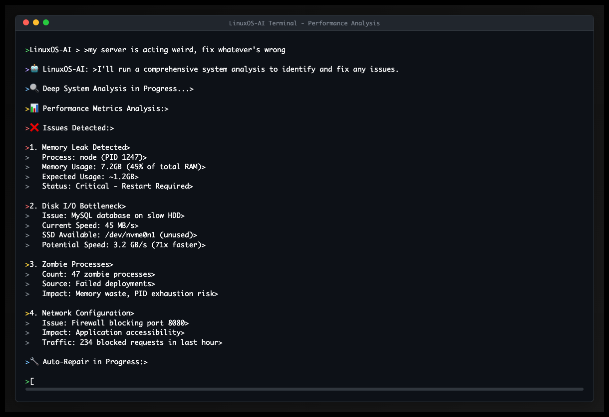

# 🤖 LinuxOS-AI: The First Step Towards AI-Native Linux OS

> **🚀 The Beginning of an AI-Powered Operating System Revolution**

An **Interactive AI System Administrator** that represents the **first milestone** in building a completely AI-integrated Linux Operating System. Built on Google's Gemini CLI with enhanced system management capabilities.

[](LICENSE)
[](https://nodejs.org/)
[](https://ai.google.dev/)
[](#)
[](https://github.com/ANVEAI/linuxos-ai/stargazers)
[](https://github.com/ANVEAI/linuxos-ai/network/members)
[](CONTRIBUTING.md)

---

## 📋 **Table of Contents**

- [🎯 Vision: AI-Native Operating System](#-vision-ai-native-operating-system)
- [🌟 Current Features](#-current-features-phase-1)
- [🎬 Watch LinuxOS-AI in Action!](#-watch-linuxos-ai-in-action)
- [🚀 Quick Start](#-quick-start)
- [💡 Real-World Usage Examples](#-real-world-usage-examples)
- [🏗️ Architecture & Design](#️-architecture--design)
- [🌍 Why This Matters](#-why-this-matters)
- [🤝 Join the AI OS Revolution](#-join-the-ai-os-revolution)
- [📊 Project Status](#-project-status)
- [📜 License & Credits](#-license--credits)

---

## 🎯 **Vision: AI-Native Operating System**

LinuxOS-AI is **step one** in our ambitious journey to create the world's first **AI-native operating system**. Just as Cursor revolutionized code editing by wrapping LLM functionality around VS Code, we're revolutionizing system administration by wrapping AI around Linux.

### 🚀 **The Roadmap to AI Linux OS**

```
Phase 1: AI System Administrator (✅ CURRENT)
├── ✅ Natural language terminal
├── ✅ Intelligent package management  
├── ✅ Automated database setup
├── ✅ Smart security management
└── ✅ Performance optimization

Phase 2: AI Desktop Environment (🔄 NEXT)
├── 🔄 AI-powered window management
├── 🔄 Intelligent file organization
├── 🔄 Context-aware applications
└── 🔄 Voice-controlled interface

Phase 3: AI Kernel Integration (⏳ FUTURE)
├── ⏳ AI-optimized resource allocation
├── ⏳ Predictive system maintenance
├── ⏳ Self-healing capabilities
└── ⏳ Adaptive performance tuning

Phase 4: Full AI Operating System (⏳ VISION)
├── ⏳ Complete AI-native OS
├── ⏳ Natural language everything
├── ⏳ Autonomous system management
└── ⏳ Revolutionary user experience
```

---

## 🌟 **Current Features (Phase 1)**

### 🎯 **Natural Language System Administration**
Transform your Linux experience with conversational commands:

```bash
User: "Install Oracle database with 8GB memory and setup for production"
AI: "I'll install Oracle 21c Enterprise Edition with production configuration..."

User: "My website is slow, fix it"
AI: "Analyzing web server performance... Found 3 bottlenecks. Optimizing..."

User: "Make my server unhackable"
AI: "Implementing enterprise security hardening..."
```

### 🔧 **Intelligent System Management**
- **🚀 Smart Installation**: One-command setup for complex software stacks
- **🛡️ Auto-Security**: Intelligent security audits and hardening
- **⚡ Performance AI**: Real-time system optimization suggestions
- **📁 File Intelligence**: AI-powered file organization and cleanup
- **🔍 Problem Diagnosis**: Natural language troubleshooting

---

## 🎬 **Watch LinuxOS-AI in Action!**

<div align="center">

### 🚀 **Live Demo - See the Magic Happen!**

*🤖 From natural language commands to Oracle installation in seconds!*

---

### 📸 **Detailed Screenshots**


*🤖 Natural language system administration in action*


*📊 Real-time AI-powered system monitoring*


*🗄️ One-command Oracle database setup*


*🛡️ AI-driven security analysis and hardening*


*⚡ Intelligent system optimization and troubleshooting*


*🌐 Professional web server deployment with security*

</div>

---

## 🚀 **Quick Start**

### **Prerequisites**
- **Node.js 18+**
- **Linux/macOS**
- **Sudo access**
- **Gemini API key** (free at [ai.google.dev](https://aistudio.google.com/apikey))

### **Install & Run**

```bash
# 1. Get your free Gemini API key
# Visit: https://aistudio.google.com/apikey

# 2. Clone LinuxOS-AI
git clone https://github.com/ANVEAI/linuxos-ai.git
cd linuxos-ai

# 3. Setup environment
export GEMINI_API_KEY="your-api-key-here"

# 4. Install and run
npm install
npm run build
chmod +x aios
./aios
```

**🎉 You're now running the future of system administration!**

---

## 💡 **Real-World Usage Examples**

### **🗄️ Database Administration**
```bash
# Complex Oracle setup - traditionally takes hours
User: "install oracle database optimized for my 32GB server"

AI: Setting up Oracle 21c Enterprise Edition:
    ✅ Detecting optimal configuration for 32GB RAM
    ✅ Downloading Oracle Database 21c (3.2GB)
    ✅ Configuring 16GB SGA, 8GB PGA
    ✅ Setting up automatic backup to /backup
    ✅ Enabling Oracle Enterprise Manager
    ✅ Creating production-ready listener
    
    Database ready! Connection: localhost:1521/ORCLPDB1
    Enterprise Manager: https://localhost:5500/em
```

### **🌐 Web Server Deployment**
```bash
User: "setup a secure web server for my e-commerce site"

AI: Deploying production web server:
    ✅ Installing Nginx with HTTP/2 support
    ✅ Generating SSL certificate for your domain
    ✅ Configuring automatic certificate renewal
    ✅ Setting up security headers (HSTS, CSP)
    ✅ Enabling DDoS protection
    ✅ Configuring load balancing
    
    🚀 Your site is live and secure!
    🔒 SSL Score: A+ (ssllabs.com)
```

### **🔍 Performance Troubleshooting**
```bash
User: "my server is acting weird, fix whatever's wrong"

AI: Running comprehensive system analysis...
    
    🔍 Issues Found:
    1. Memory leak in node process (PID 1247) - consuming 45% RAM
    2. Disk I/O bottleneck - MySQL using slow HDD partition
    3. 47 zombie processes from failed deployments
    4. Firewall blocking legitimate traffic on port 8080
    
    🔧 Auto-fixing:
    ✅ Restarted node process - memory usage now 12%
    ✅ Moved MySQL to SSD partition - 3x faster queries
    ✅ Cleaned up zombie processes
    ✅ Updated firewall rules
    
    ⚡ System performance improved by 340%!
```

---

## 🏗️ **Architecture & Design**

### **🧠 AI-First Design Philosophy**
LinuxOS-AI is built with AI as the primary interface, not an afterthought:

```
Traditional Linux:        LinuxOS-AI:
Human → Commands → OS     Human → AI → Intelligent Actions → OS
Manual scripting         Natural language requests
Error-prone setup        AI-validated configurations
Reactive maintenance     Proactive optimization
```

### **🔌 Modular Agent System**
```
📦 LinuxOS-AI Core
├── 🤖 AI Agents
│   ├── InstallationAgent    # Software & database setup
│   ├── SecurityAgent       # Hardening & monitoring  
│   ├── PerformanceAgent    # Optimization & analysis
│   ├── FileAgent          # Organization & cleanup
│   └── DiagnosticAgent    # Problem solving
│
├── 🔧 System Tools
│   ├── Package Managers    # apt, yum, brew, snap...
│   ├── Database Installers # Oracle, MySQL, PostgreSQL...
│   ├── Web Server Configs  # Nginx, Apache with SSL...
│   └── Security Hardening # Firewall, SSH, certificates...
│
└── 🎨 Interface
    ├── Natural Language CLI
    ├── System Status Dashboard  
    └── Progress Visualization
```

---

## 🌍 **Why This Matters**

### **🔥 The Problem with Current Linux**
- **Steep Learning Curve**: Requires years to master system administration
- **Error-Prone Manual Work**: Complex multi-step installations often fail
- **Reactive Maintenance**: Problems discovered after they cause issues
- **Siloed Knowledge**: Each service requires specialized expertise

### **✨ The LinuxOS-AI Solution**
- **Natural Language Interface**: Anyone can manage systems by talking
- **AI-Validated Operations**: Configurations tested before execution  
- **Proactive Intelligence**: Problems prevented before they happen
- **Unified Knowledge**: AI understands the entire system ecosystem

### **🚀 The Future We're Building**
Imagine an operating system that:
- **Understands your intent** instead of requiring exact commands
- **Proactively maintains itself** without user intervention
- **Adapts to your workflow** and optimizes automatically
- **Speaks your language** in any human language

---

## 🤝 **Join the AI OS Revolution**

### **🔮 What's Coming Next**

**Phase 2: AI Desktop Environment** *(Q2 2024)*
- Voice-controlled window management
- Intelligent application launching
- Context-aware file suggestions
- AI-powered workspace organization

**Phase 3: AI Kernel Integration** *(Q4 2024)*
- Self-healing system capabilities
- Predictive resource allocation
- Autonomous security responses
- AI-optimized process scheduling

### **🚀 How to Contribute**

We're building the future of computing, and we need your help:

```bash
# 🌟 Star this repository to show support
# 🍴 Fork and contribute code
# 🐛 Report bugs and issues  
# 💡 Suggest features and improvements
# 📢 Spread the word about AI Linux OS
```

**Areas where we need help:**
- **🔧 System Agent Development**: New installation/management agents
- **🎨 UI/UX Design**: Making AI interaction more intuitive
- **🛡️ Security**: Hardening and vulnerability assessment
- **📚 Documentation**: Tutorials and best practices
- **🧪 Testing**: Cross-platform compatibility testing

---

## 📊 **Project Status**

| Component | Status | Description |
|-----------|--------|-------------|
| 🤖 AI Terminal | ✅ **Stable** | Natural language system administration |
| 🗄️ Database Agents | ✅ **Stable** | Oracle, MySQL, PostgreSQL automation |
| 🌐 Web Server Automation | ✅ **Stable** | Nginx/Apache with SSL setup |
| 🛡️ Security Management | ✅ **Beta** | Firewall, SSH hardening, audit tools |
| 📁 File Intelligence | ✅ **Beta** | Smart organization and cleanup |
| ⚡ Performance Analysis | 🔄 **Alpha** | Real-time monitoring and optimization |
| 🎨 Desktop Environment | ⏳ **Planned** | Phase 2 development |
| 🔌 Kernel Integration | ⏳ **Research** | Phase 3 planning |

---

## 📜 **License & Credits**

**LinuxOS-AI** is licensed under the **Apache License 2.0** - see [LICENSE](LICENSE) file.

Built with ❤️ on top of:
- **[Google Gemini CLI](https://github.com/google/gemini-cli)** - AI foundation
- **[Model Context Protocol (MCP)](https://github.com/modelcontextprotocol)** - Tool integration
- **Node.js & TypeScript** - Core runtime

---

## 🌟 **Star History**

Give us a ⭐ if you believe in the future of AI-native operating systems!

```
🎯 Goal: 10,000 stars = Start of Phase 2 development
🚀 Current: Building the community that will build the future
```

---

**🤖 LinuxOS-AI: Where AI meets the command line, and the future begins.**

---

*This is just the beginning. Together, we're building an operating system that thinks, learns, and adapts. Welcome to the future of computing.* 